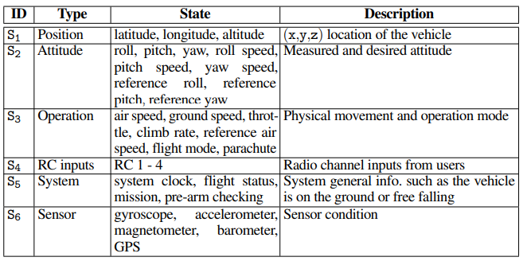

## PGFUZZ论文实验流程

### A. Pre-Processing

#### 1. Extracting MTL Policies

通过**需求工程**来确定rv的策略（但是后面并没有看到自动化的说明，可能需求工程不涉及自动化），并使用形式化逻辑来表示这些策略

手动从官方文档和源代码的注释中提取安全策略

通过这个过程，确定了56个策略，ArduPilot为30个，PX4为21个，Paparazzi为5个

#### 2. Profiling Engine

**这一步是为了减少fuzzing的巨大输入空间，针对特定策略，只用改变与该策略有关的输入。**

ArduPilot （v.4.0.3）支持1,140个配置参数(InputP)、58个用户命令(InputC)和168个环境因素(inputE)。分析引擎的目标是排除与fuzzing无关的输入，以减少巨大的输入空间。

用户命令(InputC)和环境因素(inputE)通过动态分析将其映射到各个状态

配置参数(InputP)不光会动态分析，还需要静态分析源代码将其映射到各个状态

中间过程还有一步分析三类参数之间的依赖关系<u>（但是看代码好像没有这部分，论文部分也没有说到如何利用参数之间的依赖关系-第V章，A部分，Profiling Engine部分，第三段  -> ）</u>

观察到论文有些策略并不完全是官方定义的，比如A.BRAKE策略，它定义为设置BRAKE模式之后，位置必须保持不变。但是并没有说明设置BRAKE模式多少时间之后保持不变。论文在最后得到参数状态映射后，再次通过动态分析得到该策略的未指明的时间。

##### a. Mapping Each Policy onto Terms

github项目中将状态分为了15类，但是论文里面只分了六类

安全策略相关的term有：1、状态；2、配置参数InputP；3、环境参数InputE

##### b. Static Analysis for Narrowing Fuzzing Space 

静态分析用于识别与每个配置参数相关的term。论文使用两种互补的方法来识别相关术语：

(1)在LLVM中间表示(IR)级别进行静态分析，(2)解析车辆手册。

通过def-use chain分析参数影响的状态

然后通过手动构建同义词表，配合def-use chain，分析哪些参数影响哪些状态<u>（感觉这一步比较繁琐复杂，涉及程序静态分析的知识）</u>

##### c. Dependency among Inputs

一些输入需要在执行其他输入之前执行。例如，降落伞命令只能在CHUTE_ENABLED参数为true时触发。需要首先找到这样的输入，除非前面有另一个输入，否则输入是无效的。

这一步确定应该首先执行哪个输入以执行目标输入。此外，这一步还通过消除RV模拟器不支持的用户命令(InputC)和配置参数(InputP)来缩小输入参数空间

具体步骤：

在任意模式下，先不输入参数静置一分钟，得到无人机状态，再输入参数inputJ（属于InputC∪InputP），一分钟后得到状态，判断这两个状态差值，如果状态没有变化，则说明输入无效。

然后遍历inputK（属于InputC∪InputP），先输入inputK再输入inputJ，如果inputJ使无人机状态变化，说明inputJ需要在inputK之后才有效；如果遍历完InputC∪InputP，没有InputK使InputJ有效，则说明InputJ是无效的。

这一步在代码中并未实现，而是直接针对每个策略定义preconditions.txt说明该策略的参数激活的必要条件，在动态分析步骤中也有preconditions.txt用于更好的动态分析

##### d. Dynamic Analysis for Narrowing Fuzzing Space

这一步中，根据执行的输入分析车辆的哪些状态发生了变化。导出参数-term映射表

##### e. Extracting Inputs Related to Each Policy

这一步如题，简单的映射抽取

##### f. Analyzing Unknown Time Constraints of MTL formulas

这一步有很多人工的部分，计算特定策略的时间限制k，需要对该策略重复分析，比如刹车后多少秒必须保持不动，论文在不同状态下刹车100次，取保持不动所用的最长时间作为k。（但是之后测试的过程感觉类似fuzzing，那之后检测到这个漏洞不就说明测试的数量不够吗？或者说可以根据这个计算的k作为参考值，如果之后测量发现刹车远远大于k，才算检测到策略违反）

### B. Policy-Guided Fuzzing