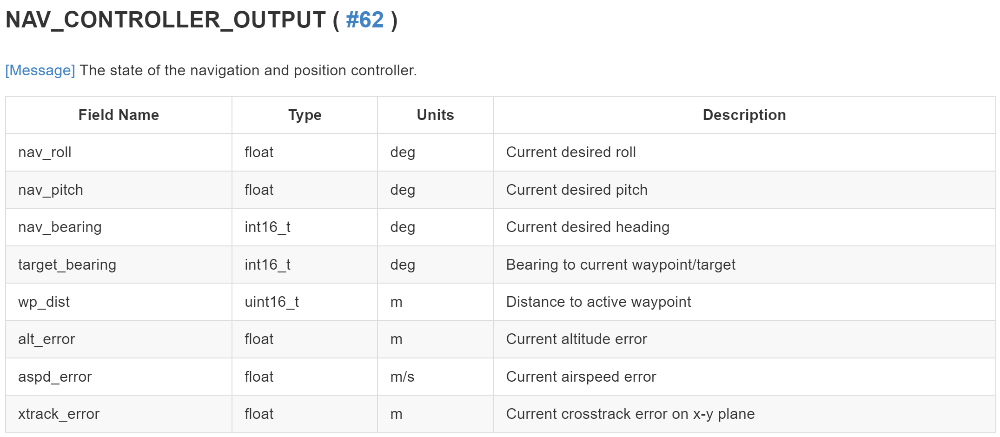
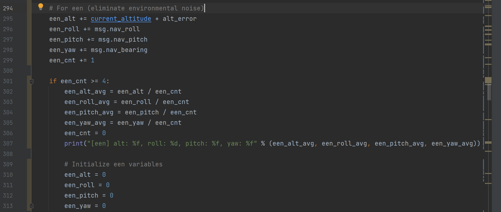
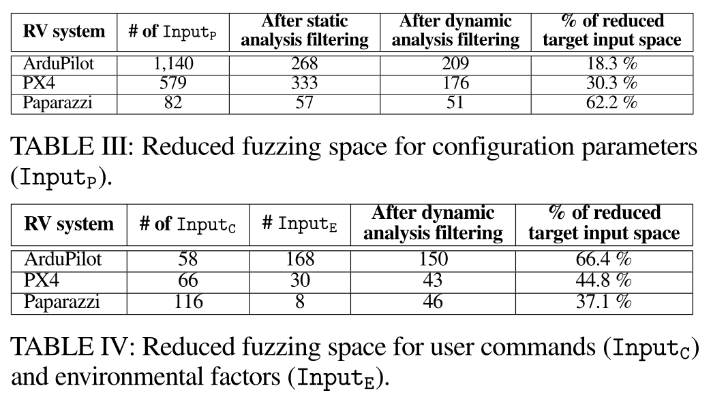
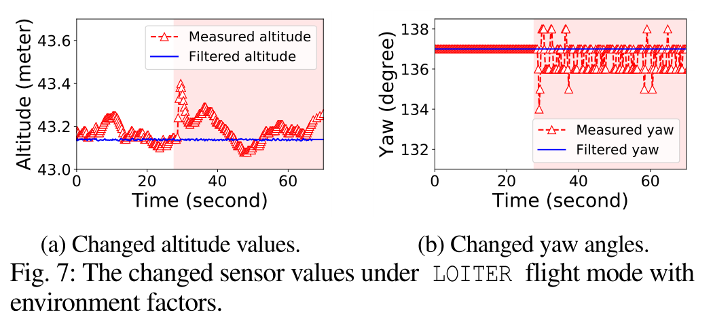
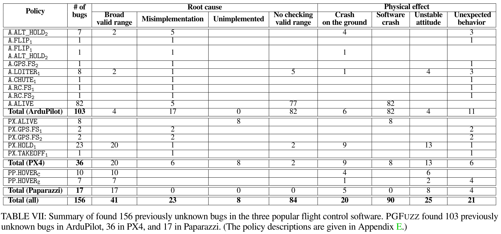
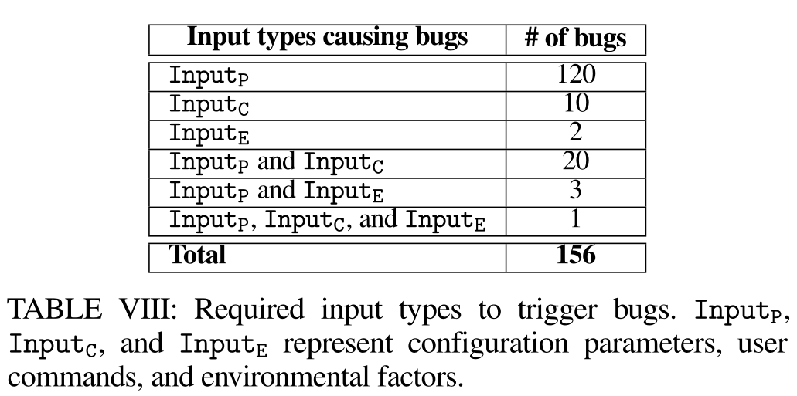

## PGFUZZ论文实验流程

==高亮：有待解决的问题==

<u>下划线：论文描述有困扰，不理解或者说可以改进的地方</u>

### A. Pre-Processing

#### 1. Extracting MTL Policies

通过**需求工程**来确定rv的策略（但是后面并没有看到自动化的说明，可能需求工程不涉及自动化），并使用形式化逻辑来表示这些策略

手动从官方文档和源代码的注释中提取安全策略

通过这个过程，确定了56个策略，ArduPilot为30个，PX4为21个，Paparazzi为5个

#### 2. Profiling Engine

**这一步是为了减少fuzzing的巨大输入空间，针对特定策略，只用改变与该策略有关的输入。**

**ArduPilot （v.4.0.3）支持1,140个配置参数(InputP)、58个用户命令(InputC)和168个环境因素(inputE)**。分析引擎的目标是排除与fuzzing无关的输入，以减少巨大的输入空间。

用户命令(InputC)和环境因素(inputE)通过动态分析将其映射到各个状态

配置参数(InputP)不光会动态分析，还需要静态分析源代码将其映射到各个状态

中间过程还有一步分析三类参数之间的依赖关系<u>（但是看代码好像没有这部分，论文部分也没有说到如何利用参数之间的依赖关系--> (已解决）第V章，A部分，Profiling Engine部分，第三段  ）</u>

##### 1. Mapping Each Policy onto Terms

github项目中将状态分为了15类，但是论文里面只分了六类

安全策略相关的term有：1、状态；2、配置参数InputP；3、环境参数InputE

##### 2. Static Analysis for Narrowing Fuzzing Space 

静态分析用于识别与每个配置参数相关的term。论文使用两种互补的方法来识别相关术语：

(1)在LLVM中间表示(IR)级别进行静态分析，(2)解析车辆手册。

通过def-use chain分析参数影响的状态

然后通过手动构建同义词表，配合def-use chain，分析哪些参数影响哪些状态<u>（感觉这一步非常繁琐复杂，涉及程序静态分析的知识）</u>

##### 3. Dependency among Inputs

一些输入需要在执行其他输入之前执行。例如，降落伞命令只能在CHUTE_ENABLED参数为true时触发。需要首先找到这样的输入，除非前面有另一个输入，否则输入是无效的。

这一步确定应该首先执行哪个输入以执行目标输入。此外，这一步还通过消除RV模拟器不支持的用户命令(Input~C~)和配置参数(Input~P~)来缩小输入参数空间

具体步骤：

在任意模式下，先不输入参数静置一分钟，得到无人机状态，再输入参数Input~J~（属于Input~C~∪Input~P~），一分钟后得到状态，判断这两个状态差值，如果状态没有变化，则说明输入无效。

然后遍历Input~K~（属于Input~C~∪Input~P~），先输入Input~K~再输入Input~J~，如果Input~J~使无人机状态变化，说明Input~J~需要在Input~K~之后才有效；如果遍历完Input~C~∪Input~P~，没有Input~K~使Input~J~有效，则说明Input~J~是无效的。（<u>如果Input~J~需要两个参数才能激活怎么办，考虑激活一个参数之后，遍历一遍之前的无效参数集合，检测是否有参数可以导致状态变化；这种直接模拟的方法效率低，有没有更好的程序分析方法</u>）

这一步在代码中并未实现，而是直接针对每个策略定义preconditions.txt说明该策略的参数激活的必要条件，在动态分析步骤中也有preconditions.txt用于更好的动态分析

##### 4. Dynamic Analysis for Narrowing Fuzzing Space

这一步中，根据执行的输入分析车辆的哪些状态发生了变化。导出输入参数input—term状态的映射表

##### 5. Extracting Inputs Related to Each Policy

这一步如题，简单的从映射中提取相关输入

##### 6. Analyzing Unknown Time Constraints of MTL formulas

观察到论文有些策略并不完全是官方定义的，比如A.BRAKE策略，它定义为设置BRAKE模式之后，位置必须保持不变。但是并没有说明设置BRAKE模式多少时间之后保持不变。论文在最后得到参数状态映射后，再次通过动态分析得到该策略的未指明的时间。

这一步有很多人工的部分，计算特定策略的时间限制k，需要对该策略重复分析，比如刹车后多少秒必须保持不动，论文在不同状态下刹车100次，取保持不动所用的最长时间作为k。（<u>但是之后测试的过程感觉类似fuzzing，那之后检测到这个漏洞不就说明测试的数量不够吗？或者说可以根据这个计算的k作为参考值，如果之后测量发现刹车远远大于k，才算检测到策略违反</u>）

### B. Policy-Guided Fuzzing

#### 1. Overview of Policy-Guided Fuzzing

针对策略进行模糊测试，检测到策略违反或者超时后停止（<u>但是算法里写的逻辑是未检测到策略违反或者未超时就继续循环</u>，==后续可以看具体实现的逻辑==）

#### 2. Noise Elimination

消除环境噪声的影响（传感器噪声或者风的影响），如果不消除环境噪声则可能错误地引导突变引擎

PGFUZZ使用飞行控制软件的控制算法中的参考状态值作为当前状态（该状态为无噪声的期望状态值），控制程序使用滤波算法(如卡尔曼滤波)计算参考状态（论文说ArduPilot的控制程序一直在计算参考状态值，这是在哪计算的--==已解决==）。但是，恶劣环境条件（例如10米/秒风速）下的参考状态仍然包括噪声。为了处理这个问题，PGFUZZ还利用移动平均Moving_average(State_i~act~+State_i~err~)来消除环境噪声。（<u>Moving_average的具体算法过程没看到，PGFUZZ是怎么改进的==已解决==，ArduPilot原本的计算在恶劣环境下为什么会有问题</u>）

<u>上图为MAVLINK协议的NAV_CONTROLLER_OUTPUT信息，包含的消息有参考状态的roll pitch yaw角度以及alt aspd的err值等信息，论文只计算了roll pitch yaw alt的消除环境噪声（een）值，代码接收4个时间段的信息并计算参考状态值，然后取4个时间段的参考状态值得平均作为状态参考值，这样计算出来的参考状态值更加稳定。==但是4个时间段计算过后就清零了，相当于4个时间段融合为1个时间段，是不是更改为滑动窗口更为合适，这样每个时间段都能够得到稳定的参考值==</u>

#### 3. Policy Checker

给出MTL公式和当前状态，计算两个度量：（1）命题距离来指导突变引擎；（2）全局距离来通知oracle出现了策略违反。

两个距离不是单独无关的，命题距离的组合生成全局距离

Policy Checker首先将always形式的MTL公式转换为not eventually形式的MTL公式，然后对命题距离进行算术计算（不理解always形式和not eventually形式的MTL公式是什么意思，这里解释的不清楚，但是看后面的例子解释，是将蕴含关系->转换为与和逆命题组合，A->B  == ~(A & ~B），并且对于MTL公式中的时间限制，有always和not eventually等形式，在逆命题变化时，时间限制也会发生相应变化，需要==了解一下MTL公式==）

最后通过命题距离的组合计算全局距离，将“not”、“and”、“or“转化为−1、min()和max()， 例如降落伞策略的全局距离就被转换为−1×[min{P1,max(P2,P3,P4,P5)}，然后通过程序计算得到全局距离

##### 命题距离的计算

离散值的命题（比如降落伞是否打开）距离设置为-1或1，分别表示命题为假或为真

连续值的命题（命题的真假与连续值有关，比如高度）采用规格化的命题距离，尽量维持在-1到1之间（因为极端情况也有可能绝对值大于1，比如当前高度必须大于CHUTE_ALT_MIN，命题距离为当前（CHUTE_ALT_MIN - ALT）/ CHUTE_ALT_MIN，当当前高度大于2*CHUTE_ALT_MIN时，则会出现命题绝对值大于1的情况）

#### 4. Mutation Engine

Mutation Engine向模拟器提供输入以最小化全局距离，其中**全局距离的负值表示策略违反**。

论文作了一个假设：命题距离最大化(并使其为正)会导致全局距离最小化(并使其为负)，因为在计算全局距离时，命题距离组合之后被置为负数了。（==这个假设真的合理吗==，<u>降落伞策略A_CHUTE的全局距离计算公式为−1×[min{P1,max(P2,P3,P4,P5)}，这是符合假设的，那有没有策略没有乘以-1呢；如果不合理的话，感觉需要对不同的策略进行不同的处理，那么有没有一种新的假设能够满足所有策略呢，比如针对MTL公式计算其最终值，MTL公式中的原子项对最终结果的影响，如果是单调的话就可以得到该原子项的最终期望值了</u>）

##### Mutation Engine变异策略

1. 它首先从目标策略的Inputmin中随机选择一个输入，该输入存储在输入策略映射中。然后，它随机选择一个值并将其赋值给输入。
2. 在模拟器上执行所选输入，计算命题距离和全局距离，如果全局距离为负，则标记策略违反。
3. 如果执行的输入增加了命题距离，突变引擎将输入与指定值一起存储。例如，如果输入在增加高度，它有助于增加命题距离P4。突变引擎存储这个输入值对(高度、增加)（<u>存储参数名和对应值键值对？</u> -> <u>以后面的例子来看是存储的参数名和对应值</u>）。
4. 当突变引擎再次随机选择存储的输入(例如，改变高度)时，它将存储的值应用于输入，而不是随机分配一个新的值给输入。例如，它执行(altitude,increase)来不断增加命题距离（<u>==核心变异策略==这一步是否可以改进，比如当该命题距离已经足够大的时候，可以不用再增加该命题距离转而尝试增加其他命题的命题距离；能否将各个命题对应的能增加其命题距离的参数输入进行归类，想要增加某个命题距离的时候，从该命题对应的输入参数集合中选择输入</u>）。
5. 突变引擎重复步骤1~4，直到发现策略违规。如果PGFUZZ找不到策略违规，那么当输入序列的大小超过1000或模糊时间超过2小时时，它将停止模糊处理。然后，PGFUZZ将目标策略更改为另一个策略。

#### 5. Working Example

讲了一个简单的发现违反策略的例子，主要过程同前面几步的介绍，主要问题还是变异引擎的合理性，论文中给的例子是只要是随机选择的输入能够增加其中安全策略任意一个命题距离，都将该参数存储起来，之后再次随机选择到该参数时候，直接使用该参数。

参数变异方法很粗糙。思考问题：

1. 参数输入有点像广度搜索，每次都随机从Input~min~选择参数并且赋值（随机或者指定之前的值），是否选取参数然后修改参数直到它会影响的命题距离足够大（或者足够好，因为前面的假设命题距离越大越好不一定对），该思路类似于深度搜索
2. 之前能让命题距离变大的参数值在之后都采用相同的参数值吗，这样的假设合理吗，会不会太死板。无人机在不同的状体下同样的输入参数以及参数值可能会有不用的效果，能不能预处理出来参数对无人机状态的影响（更可能让其变高或者变低）从而更好地引导参数变异

### C. Bug Post-Processing

Bug Post-Processing目的是查找导致策略违反的最小输入序列，通过最小化的序列可以用于分析违规的根本原因。

## PGFUZZ实验评估

### A. Component Evaluation

#### Profiling Engine Evaluation

展示了经过Profiling Engine后的输入参数空间缩小的比例

#### Noise Elimination

展示了Noise Elimination后的状态计算结果

### B. Framework Evaluation

#### 评估结果

##### Bug分类

###### Broad valid range

配置参数的有效范围设置不正确。例如，ATC_RATE_R_MAX的有效范围是0到1080。然而，当用户分配少于100，车辆导致不稳定的姿态控制和坠毁在地面上。

###### Misimplementation

在开发人员实现特性后，不能在正常情况下或在特定情况下正常工作。例如，PX4在特定飞行模式下无法触发GPS故障安全模式。

###### Unimplemented

未实现的传感器故障处理条件，尽管这些在他们的文档中提到。我们发现了这样的错误，特别是在PX4中。

###### No checking valid range

不检查配置参数的有效范围。例如，当ATC_RATE_R_MAX参数被赋值给预定义范围之外的值时，车辆会产生浮点异常。

##### Bug导致的物理影响分类

###### Crash on the ground

表示车辆失去姿态控制，然后向GCS发送自由落体警告信息。

###### Software crash

发生在飞行控制软件由于浮点异常而崩溃的情况下。

###### Unstable attitude

表示车辆有姿态波动

###### Unexpected behavior

代表了所有其他问题，包括未检查改变飞行器状态的先决条件(第VII-C1节)，未能保持在相同高度(第VII-C2节)，杂技飞行后计算高度错误(第VII-C3节)，以及未能触发故障安全模式(第VII-C4节)。

#### Analysis of Bugs

将bug进行分析分类，“misimplemented”和 “unimplemented”定义为逻辑错误；“broad valid range” 和 “no checking valid range” 包含输入验证错误和内存安全错误，当输入验证错误导致内存损坏时，被定义为内存安全错误；当识别出的bug不会导致飞机坠毁、不稳定的姿态和不正确的高度时，认为它们是无害bug。

#### False Positives

排除了以下导致违反假阳性策略的Input~set~：(1)影响硬件配置(例如，设备id)的Input；(2)关闭引擎的Input~C~。

<u>（但是正常策略不应该是不能够随意输入这些值吗，这些不算是No checking valid range吗，这一部分在Accuracy of the Minimized Input Space进一步讨论，结果是文中不认为这些算真正的破坏策略，这种自我破坏的命令不在文章考虑范围）</u>

#### Analysis of Input Types.

每个策略违反都是由不同类型的输入触发的。表中列出了不同输入类型导致的错误数量。该分析详细说明了对手触发错误所需的能力。一些错误只需要单种类型的输入就可以触发

#### Comparison of PGFUZZ with no Policy-guided Mutation

比较了PGFUZZ和不使用策略引导突变的模糊处理的结果，结果当然是完整的PGFUZZ检测漏洞的效率最高

#### Accuracy of the Minimized Input Space

分析了PGFUZZ最小输入空间的合理性：

1. 排除的输入不会影响与策略相关的物理状态；

2. 大多数被排除的输入都是自我破坏的。例如，GPIO引脚配置和关闭执行器的命令。虽然这些输入会导致异常行为，但文中不认为这些情况是策略违反/bug。（第三章内容：对手也可以通过发送恶意命令(例如，停止执行器)简单地丢弃或解除车辆的武装;然而，这些攻击不是隐形的。特别是，这种自我破坏输入可以很容易地识别和防止运行时任务监测工具，由车辆和地面控制系统[25]和[46]执行。相比之下，由于发送看似无害的输入而触发的策略违反更隐蔽，监视工具也更难检测到。由于这些原因，我们不认为这些自我破坏攻击在本文的范围内。）

#### Comparison of PGFUZZ with RVFuzzer

RVFuzzer使用的参数只有配置参数和风这一个环境参数

1. 如果策略违规不影响飞行器的姿态和飞行路径，RVFuzzer就不能检测到违规
2. 有些错误只在用户命令、环境因素和配置参数中发生。但是RVFuzzer只改变配置参数的输入
3. RVFuzzer由于其有限的二分法搜索，无法发现一些bug。例如，PSC_ACC_XY_FILT的默认值是2.0。PSC_ACC_XY_FILT为0和2.0时，车辆不显示任何不安全状态。在这种情况下，RVFuzzer的结论是[0,2]是一个安全的有效范围。然而，当PGFUZZ将参数赋值为0.0001时，飞行器会导致姿态不稳定，甚至在地面上坠毁。

#### Responsible Disclosure

发现的156个漏洞有106个被开发者确认，被确认的漏洞有一些已经被修补，有一些将要被修补。还有71个导致软件崩溃的参数范围检测漏洞开发者说不会修补（即使官方文档中给出了参数范围），因为如果每个参数都加了范围检测，微控制器可能会不能够正常工作。

### C. Case Studies

## 疑问

### PGFUZZ每次输入之后间隔多长时间才进行下次输入

## 新的可能的研究突破点

### 0. 本质创新点

19年的RVFuzzer、20年的CPI和21年的PGFUZZ的创新核心：他们都**定义了一种新的错误状态（漏洞、缺陷、风险）**。例如19年的RVFuzzer研究的是飞行控制程序与“飞行状态不稳定”错误状态的关系；20年的CPI研究的是safety check程序与“网络空间物理空间不一致”错误状态的关系，本质是数字空间的safety check程序的执行和判断是离散和数字的，且和物理空间真实的模拟、连续的情况有差别，导致错误发生。21年的PGFUZZ研究的是安全策略执行程序是否正确执行了策略规定这个缺陷。

### 1. 深度扩展

安全策略的自动化描述与建模。使用NLP自然语言处理，自动化的把无人机安全策略变为MTL逻辑表达；

命题距离度量是否有更合理方法？

策略冲突类漏洞发现。不同安全策略间的制约或冲突关系，是否被程序正确执行，这个缺陷还没有方法进行发现；

对策略进行分类。例如，能用简单逻辑描述的离散策略与能用复杂/连续逻辑描述的连续策略（这类策略容易出现网络空间和物理空间判断不一致的情况，需要特别考虑检测与防御方法）；

自动发现隐藏安全策略或建立新的安全策略。对CPS等无人智能系统，能否自动化的发现隐藏的安全策略？或能否自动化规定/建立新的安全策略？又如何保证程序能正确执行？

### 2. 深度扩展

产生该问题的根本原因分析，预防方法，防御方法，实时检测方法？例如，防御包括：设计一种新的程序编程方法，有验证机制等，可以保证其遵守该规则的执行；

设计物理（硬件）的保障机制，“硬”预防安全策略破坏的错误发生；

或能否在物理世界或和网络世界混合的情况下，设置一些判断或措施，使得不能违反策略；

### 3. 深度扩展

采取静态分析的方法，寻找无人智能系统中，程序没有按照安全策略执行的缺陷；

或仅仅分析log，不静态分析程序，也不进行动态运行程序，来找给类型漏洞；

用机器学习代替仿真，加速缺陷检测过程；

### 4. 广度扩展

在其他类型的无人智能系统中，找到本文提出的“安全策略不执行”的缺陷，例如机器人系统、无人机编队系统、工业控制系统等网络空间和物理空间深度融合的系统，甚至可以增加一个融合维度：社会系统，这样的“语义”就更丰富，程序出差的可能性就更大。