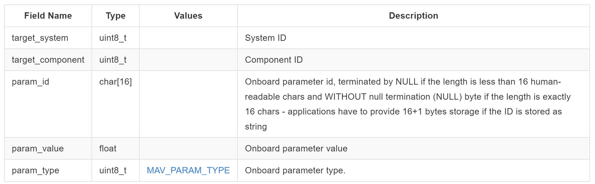

# PGFUZZ项目实验流程

## XML Parser

通过读取官方文档中给的参数信息（XML文件），处理得到各个参数对应的：

  (1) Parameter name（参数名）
  (2) Description（描述）
  (3) Valid range（有效范围）
  (4) Increment unit（增加粒度）
  (5) Read-only or not（是否只读）

==（但是看策略的parameter.txt文件，对应的是Parameter_name, Description, default_value, Min_value, Max_value, Increment_unit)==

## <u>Dynamic Analysis</u>

### 杂项

动态分析将用户命令参数和环境参数映射到各个状态上<u>（为什么没有配置参数，配置参数是静态分析？）</u>，之后在分析状态时就只用变异与其有关的参数。

<u>（看PGFuzz文档里面，生成的结果很少，状态最多只与两三个用户命令参数和环境参数相关，还有一些状态没有相关的用户命令参数和环境参数）</u>**！已解决**：官方文件中Dynamic_Analysis_Results_ArduPilot.xlsx文件存储了各个状态集合对应的相关参数，这个文件里面对应的参数数量比较多，但是依旧有部分状态没有相关参数。

PGFuzz将**34**个状态分为**15**类，动态分析与这15类状态有关的用户命令参数和环境参数，运行动态分析时，会将所有输出文件创建（如不存在）或清空。

<u>（自己实验发现，PGFuzz在GitHub上的输出的15类状态相关参数，与自己复现过程中生成的参数有差异），例如position.txt文件。PGFuzz原本相关参数是RC1和RC2，但是自己跑的时候变为SIM_ACC2_BIAS_Y</u> **！已解决**：同上


### 全局变量

##### avg_(name) list

其中全局变量有很多avg_(name)列表，存储了无人机飞行过程中各个参数的不同时间的值，为了后面使用Standard_deviation(list)函数计算方差，判断无人机在这段时间内该参数有没有发生较大的变化。

### 主程序流程

1. 调用mavlink_connection()函数，通过串口、 tcp 或 udp 信道建立与 MAVLink 系统的通信链路

2. 使用request_data_stream_send函数指定无人机发送消息的类型（所有）以及发送速率

3. 设置无人机模式为“GUIDED"

4. 发送arm指令使无人机能够起飞

5. 设置高度为100，使无人机takeoff起飞

6. 创建守护线程t1，保持无人机throttle参数（控制无人机油门）在中间（为了保持无人机稳定，相当于无人机摇杆保持中位值）

7. 设置无人机模式为“STABILIZE"

8. 创建守护线程t2，循环接收无人机消息，并根据消息的类型和具体内容更新信息（特别是当前位置信息和状态历史信息列表）

9. 从"cmds.txt"读取可输入的命令和对应的索引号，从"envs.txt"读取环境参数

10. 在当前目录下创建result文件夹，并在该文件夹下创建输出文件（以写方式打开，如果之前存在内容会被清空）

11. 将"preconditions.txt"中的预先设置参数发送给无人机

12. 使用profile()函数分析各个环境参数和各个命令参数


## PGFUZZ

PGFUZZ主函数运行时，文件调用关系流程如图所示


### 主程序流程

1. f_path_def指定策略文件夹路径（每次只分析一个策略，如果要分析不同策略需要手动修改f_path_def并重新运行）

   ```
   # To do: update the below path according to a changed target policy
   f_path_def = ""
   f_path_def += "./policies/"
   f_path_def += Current_policy
   ```

2. 调用read_input模块读取策略文件夹下的配置参数、用户命令参数和环境因素参数

3. 使用request_data_stream_send函数指定无人机发送消息的类型（指定所有消息mavutil.mavlink.MAV_DATA_STREAM_ALL）以及发送速率

   ```
   # request data to be sent at the given rate
   for i in range(0, 3):
       master.mav.request_data_stream_send(master.target_system, master.target_component,
                                           mavutil.mavlink.MAV_DATA_STREAM_ALL, 6, 1)
   ```

4. 设置无人机模式为“GUIDED"

   ```
   master.mav.set_mode_send(
       master.target_system,
       mavutil.mavlink.MAV_MODE_FLAG_CUSTOM_MODE_ENABLED,
       mode_id)
   ```

5. 发送arm指令使无人机能够起飞

   ```
   master.mav.command_long_send(
       master.target_system,
       master.target_component,
       mavutil.mavlink.MAV_CMD_COMPONENT_ARM_DISARM,
       0,
       1, 0, 0, 0, 0, 0, 0)
   ```

6. 设置高度为100，使无人机takeoff起飞

   ```
   master.mav.command_long_send(
       master.target_system,  # target_system
       master.target_component,  # target_component
       mavutil.mavlink.MAV_CMD_NAV_TAKEOFF,  # command
       0,  # confirmation
       0,  # param1
       0,  # param2
       0,  # param3
       0,  # param4
       0,  # param5
       0,  # param6
       100)  # param7- altitude
   ```

7. 创建守护线程t1，保持无人机throttle参数（控制无人机油门）在中间（为了保持无人机稳定，相当于无人机摇杆保持中位值）

   ```
   # Maintain mid-position of stick on RC controller
   goal_throttle = 1500
   t1 = threading.Thread(target=throttle_th, args=())
   t1.daemon = True
   t1.start()
   ```

8. 设置无人机模式为“ALT_HOLD"

9. 创建守护线程t2，循环接收无人机消息，并根据消息的类型和具体内容更新信息（特别是当前位置信息和状态历史信息列表）

10. 将"preconditions.txt"中的预先设置参数发送给无人机

    ```
    Precondition_path += "./policies/"
    Precondition_path += Current_policy
    Precondition_path += "/preconditions.txt"
    set_preconditions(Precondition_path)
    ```

11. 创建守护线程t3，调用check_liveness函数检测模拟器是否死机，如果死机则通知重启（<u>这儿代码写的很怪，明明可以放在一个代码文件里面重启，但是分成了好几个文件用作进程通信，感觉没有必要</u>）

12. 循环判断无人机状态并根据状态做出不同处理，其中主要fuzzing部分在第三部分（drone_status == 4），主函数这里一共调用了两次calculate_distance()函数，在输入参数之前调用一次记录各个命题距离，输入参数之后调用一次记录输入参数对命题距离的影响，如果增大了命题距离则记录参数值

```
# System is grounded and on standby. It can be launched any time. The vehicle is grounded
# 重启无人机
if drone_status == 3 and RV_alive == 1:
    print("[Debug] drone_status:%d" % drone_status)
    print("### Vehicle is grounded, Home alt:%f, Current alt:%f" % (home_altitude, current_altitude))
    Armed = 0
    re_launch()
    count_main_loop = 0
```

```
# It is in mayday and going down
# 等待无人机重启（因为等待无人机坠毁后，check_liveness函数会使无人机重启）
if drone_status == 6:
    Armed = 0
    for i in range(1, 5):
        print("@@@@@@@@@@ Drone losts control. It is in mayday and going down @@@@@@@@@@")
```

```
# if RV is still active state
if drone_status == 4:
	# Calculate propositional and global distances
    calculate_distance(guidance="false")

    pick_up_cmd()

    # Calculate distances to evaluate effect of the executed input
    time.sleep(4)
    calculate_distance(guidance="true")
```


### calculate_distance(guidance)函数

**主函数一共调用两次calculate_distance()函数，在输入参数之前调用一次记录各个命题距离，输入参数之后调用一次记录输入参数对命题距离的影响，如果增大了命题距离则记录参数值**

1. 计算平均姿态、平均地理位置、平均GPS高度（计算完成后将所有counter置为0，便于计算下个周期的平均数据）

   ```
   alt_avg = alt_series / stable_counter
   roll_avg = roll_series / stable_counter
   pitch_avg = pitch_series / stable_counter
   heading_avg = heading_series / stable_counter
   
   lat_avg = lat_series / position_cnt
   lon_avg = lon_series / position_cnt
   
   alt_GPS_avg = alt_GPS_series / gps_message_cnt
   ```

2. 根据无人机当前状态的值计算各个命题距离（以A.CHUTE为例）

   ```
   # P1
   if Parachute_on == 1:
       P[0] = 1
   else:
       P[0] = -1
   # P2
   if Armed == 0:
       P[1] = 1
   else:
       P[1] = -1
   # P3
   if current_flight_mode == "FLIP" or current_flight_mode == "ACRO":
       P[2] = 1
   else:
       P[2] = -1
   
   # P4
   if current_alt > 0:
       P[3] = (current_alt - previous_alt) / current_alt
   else:
       P[3] = 0
       
   ...
   
   if target_param_value > 0:
   	P[4] = (target_param_value - current_alt) / target_param_value
   else:
   	P[4] = 0
   ```

3. 根据命题距离计算全局距离（以A.CHUTE为例）

   ```
   Global_distance = -1 * (min(P[0], max(P[1], P[2], P[3], P[4])))
   ```

4. 打印距离并作出相应处理

   ```
   print_distance(G_dist=Global_distance, P_dist=P, length=5, policy="A.CHUTE", guid=guidance)
   ```


### print_distance(G_dist, P_dist, length, policy, guid)函数

1. 如果G_dist < 0，则通过store_mutated_inputs()函数记录输入参数序列

   ```
   if G_dist < 0:
       store_mutated_inputs()
   ```

2. 如果guid == false（输入参数之前），则更新Previous_distance

   ```
   if guid == "false":
       for i in range(Current_policy_P_length):
           Previous_distance[i] = P_dist[i]
   ```

3. 如果guid == true（输入参数之后），则比较每个命题距离，如果当前命题距离比之前Previous_distance的大，说明更接近策略违反状态，将输入的参数通过write_guidance_log()函数，记录在guidance_log.txt中，guidance_log.txt记录的是四元组**（参数名称，参数值，增加的命题距离的序号，增加命题距离的大小）**。（<u>这里有很多小细节，比如之前有记录则需要判断当前增大的对应的命题距离是否比之前增大的多，如果增大的更多，就更新纪录</u>，==那么用这种增大的更多的方法判断真的合理吗，还有更重要的一点，如果一个输入增大了一些命题的距离，但是降低了另一部分的距离，我觉得不能简单地判断这个输入能让状态更接近策略违反，需要考虑整体命题距离的变化==）（<u>后续继续看选择从存储的参数中选择参数值的代码，发现，对于每个命题距离，如果当前参数值能够增加就会记录，如果一个参数能够增加多个命题距离，就会被记录多次，然后选择到相同参数的时候是从中随机选择。==这里可以加一个判断，判断某个命题距离是否被满足，如果被满足就可以不用采用当前的参数，而去选择其他命题距离未被满足对应的参数值==</u>）


### pick_up_cmd()函数

1. 参数类型从用户命令参数、配置参数、环境参数三种随机选择

   ```
   # a) Randomly select a type of inputs ( 1)user command, 2)parameter, 3)environmental factor)
   input_type = random.randint(1, 3)
   ```

2. 随机选择是否需要引导

   ```
   # True: input mutated from guidance, False: randomly mutate an input
   Guidance_decision = random.choice([True, False])
   ```

3. 随机选择类型中的参数进行输入

   ```
   # b) Randomly select an input from the selected type of inputs
   
   # 1) User commands
   if input_type == 1:
       execute_cmd(num=random.randint(0, len(read_inputs.cmd_name) - 1))
   
   # 2) Parameters
   elif input_type == 2:
       change_parameter(selected_param=random.randint(0, len(read_inputs.param_name) - 1))
   
   # 3) Environmental factors
   elif input_type == 3:
       execute_env(num=random.randint(0, len(read_inputs.env_name) - 1))
   ```


#### execute_cmd()函数

1. 创建数组rand存储7个值为0-100的随机值（

   ```
   # Each user command contains 7 parameters. We assign random values to these parameters.
   for i in range(7):
       rand.append(random.randint(1, 100))
   ```

2. 根据是否引导生成当前要输入的参数值

   ```
   if Guidance_decision == True:
       Current_input_val = match_cmd(cmd=Current_input)
   
   if Current_input_val != "null":
       print("@@@[Reuse stored input pair] (%s, %s)@@@" % (Current_input, Current_input_val))
   ```

3. 根据不同的命令参数输入提供不同的参数值，对RC要进行特判，对更改飞行模式和打开降落伞命令也进行了特判，项目注释说对于很多命令都要进行特判，因为很多命令的参数范围都不一样

4. 如果不属于特判参数之一，则使用**master.mav.command_long_send()**函数进行命令输入

   ```
   master.mav.command_long_send(
       master.target_system,  # target_system
       master.target_component,  # target_component
       int(read_inputs.cmd_number[num]),
       0,
       rand[0], rand[1], rand[2], rand[3], rand[4], rand[5], rand[6])
   ```

5. write_log()函数记录输入命令


#### change_parameter()函数

1. 根据是否引导生成当前要输入的参数值

   ```
   if Guidance_decision == True:
       Current_input_val = match_cmd(cmd=param_name)
   ```

2. 生成param_value（为没有引导值的情况下使用），如果参数有效范围不合法，则生成PARAM_MIN ~ PARAM_MAX范围内的随机整数

   ```
   if range_min == 'X':
       no_range = 1
       param_value = random.randint(PARAM_MIN, PARAM_MAX)
       print("[param] selected params: %s, there is no min of valid range, random param value:%d" % (
           read_inputs.param_name[selected_param], param_value))
   ```

3. 如果参数范围合法，根据参数范围生成随机数（<u>如果参数范围都为整数则生成整数随机数，否则生成浮点随机数</u>，==如果参数范围为0~1的话就会出现问题，只能随机到两端，不随机到中间，应该改为判断最小增加单元为整数还是浮点数，并且应该是最小单元的倍数==）

   ```
   if range_min.isdigit() == True and range_max.isdigit() == True:
       param_value = random.randint(int(range_min), int(range_max))
   
   elif range_min.isdigit() == False or range_max.isdigit() == False:
       param_value = random.uniform(float(range_min), float(range_max))
   ```

4. 使用**master.mav.param_set_send()**函数进行命令输入

   ```
   master.mav.param_set_send(master.target_system, master.target_component,
                             param_name,
                             param_value,
                             mavutil.mavlink.MAV_PARAM_TYPE_REAL32)
   ```

5. write_log()函数记录输入命令

6. **休眠3秒钟**

   ```
   write_log(print_param)
   
   time.sleep(3)
   ```


#### execute_env()函数

1. 根据是否引导生成当前要输入的参数值

   ```
   if Guidance_decision == True:
       Current_input_val = match_cmd(cmd=Current_input)
   ```

2. 如果不引导或者引导映射没有存储该变量，则1~100随机选择参数值

   ```
   if Current_input_val == "null":
       rand = random.uniform(0, 100)
       Current_input_val = str(rand)
   ```

3. 使用**master.mav.param_set_send()**函数进行命令输入

   ```
   master.mav.param_set_send(master.target_system, master.target_component,
                             Current_input,
                             float(Current_input_val),
                             mavutil.mavlink.MAV_PARAM_TYPE_REAL32)
   ```

4. write_log()函数记录输入命令


## 疑问

### lat_avg and lon_avg (*1000) (/1000)

每次做这种操作有什么意义呢，lat_avg和lon_avg都是float类型

```
lat_avg = lat_avg / 1000
lat_avg = lat_avg * 1000
lon_avg = lon_avg / 1000
lon_avg = lon_avg * 1000
```


### 某些参数值通过等待的方式获取

注意程序并不会预先存储所有的参数值，某些时候需要某些参数值并且没有预先存储时，需要指定target_param并等待收到该参数消息（<u>这一步是不是可以通过在全局变量增加相应的值从而减少等待时间并让程序不那么繁琐？==为什么parachute_on就可以预先存储，它与其他没预先存储的参数有什么不同==？如果没有不同的话，解决办法：比如给参数空间创建一个列表，对应下标就存放对应参数</u>）

```
target_param = "CHUTE_ALT_MIN"
count = 0
while target_param_ready == 0 and count < 5:
    time.sleep(1)
    count += 1

if target_param_value > 0:
    P[4] = (target_param_value - current_alt) / target_param_value
else:
    P[4] = 0
```


### MAVLINK的消息

发送命令command_long_send()

设置参数param_set_send()  （<u>设置环境因素和配置参数都是这个函数，为什么环境因素也是通过param设置</u>）

<u>它们的参数在哪里看？</u>


## pymavlink常用函数

### 创建链接-mavlink_connection()

[Python (mavgen) · MAVLink Developer Guide](https://mavlink.io/en/mavgen_python/#setting_up_connection)

```python
from pymavlink import mavutil

# Start a connection listening on a UDP port
the_connection = mavutil.mavlink_connection('udpin:localhost:14540')

# Wait for the first heartbeat 
#   This sets the system and component ID of remote system for the link
the_connection.wait_heartbeat()
print("Heartbeat from system (system %u component %u)" % (the_connection.target_system, the_connection.target_component))

# Once connected, use 'the_connection' to get and send messages
```

### 请求数据-request_data_stream_send()

使用master.mav.request_data_stream_send指定无人机发送消息的类型（所有）以及发送速率，然后使用master.recv_match读取特定参数

```
master.mav.request_data_stream_send(master.target_system, master.target_component,
                                    mavutil.mavlink.MAV_DATA_STREAM_ALL, 6, 1)
```

### 读取参数-recv_match()

等待并拦截到达的消息

```python
def recv_match(self, condition=None, type=None, blocking=False, timeout=None):
    '''Receive the next MAVLink message that matches the given type and condition
    type:        Message name(s) as a string or list of strings - e.g. 'SYS_STATUS'
    condition:   Condition based on message values - e.g. 'SYS_STATUS.mode==2 and SYS_STATUS.nav_mode==4'
    blocking:    Set to wait until message arrives before method completes. 
    timeout:     ? <!-- timeout for blocking message when the system will return. Is this just a time? -->
    '''
```

### 飞行模式Dict-master.mode_mapping()

mapping mode names to id, or None if unknown

### 发送命令设置模式参数-set_mode_send()

```
# Set new mode
master.mav.set_mode_send(
    master.target_system,
    mavutil.mavlink.MAV_MODE_FLAG_CUSTOM_MODE_ENABLED,
    mode_id)
```

### 接收ACK

发送完消息后，需要确认收到对方传回ACK，确认消息发送状态

```
# Check ACK
ack = False
while not ack:
    # Wait for ACK command
    ack_msg = master.recv_match(type='COMMAND_ACK', blocking=True)
    ack_msg = ack_msg.to_dict()

    # Check if command in the same in `set_mode`
    if ack_msg['command'] != mavutil.mavlink.MAVLINK_MSG_ID_SET_MODE:
        continue

    # Print the ACK result !
    print(mavutil.mavlink.enums['MAV_RESULT'][ack_msg['result']].description)
    # “Command is valid (is supported and has valid parameters), and was executed.”
    break
```

如果正常设置参数，则print消息为“Command is valid (is supported and has valid parameters), and was executed.”

### 发送命令command_long_send()

除了<message>_send外（如set_mode_send），还有一个发送命令的函数command_long_send，

[Messages (common) · MAVLink Developer Guide](https://mavlink.io/en/messages/common.html#COMMAND_LONG)

### 设置参数param_set_send()

[Messages (common) · MAVLink Developer Guide](https://mavlink.io/en/messages/common.html#PARAM_SET)




## 补充知识

### failsafe

因为无线电波在传输过程中可能受到干扰或是数据丢失等等问题，当接收机无法接收到发射器的数据时，通常会进入保护状态，也就是仍旧向无人机发送控制信号，此时的信号就是接收机收到遥控器发射器最后一次的有效数据。这样因为信号丢失而发送的保护数数据通常叫做failsafe数据。


### pwm脉宽调制

遥控器与无人机的通信协议，需要在无人机接收机接上全部pwm输出通道，每一个通道就要接一组线，解析程序需要根据每一个通道的pwm高电平时长计算通道数值。

无人机使用的pwm值在500-2500之间，而常用的值在1000-2000之间。

ArduPilot使用的pwm值在**1000-2000**之间，pwm值表示输出信号，代表着输出的百分比。比如对throttle channel输出pwm值为1500，则是将电机转速设置为满转速的50%。

[无人机遥控器的通道（遥控器三大通道详解） | 我爱无人机网 (woiwrj.com)](https://www.woiwrj.com/wurenjibaike/54992/)

[如果根据pwm值计算固定翼无人机的电机转速？ - 知乎 (zhihu.com)](https://www.zhihu.com/question/61271260)


### Ardupilot的RC channel

RC输入通道的默认映射，set_rc_channel_pwm函数rc_channels_override_send函数设置RC通道数值

| Channel | Meaning      |
| ------: | :----------- |
|       1 | Pitch        |
|       2 | Roll         |
|       3 | Throttle     |
|       4 | Yaw          |
|       5 | Forward      |
|       6 | Lateral      |
|       7 | Camera Pan   |
|       8 | Camera Tilt* |


### ArduPilot飞行模式讲解

1、稳定模式Stabilize

稳定模式是使用得最多的飞行模式，也是最基本的飞行模式，起飞和降落都应该使用此模式。
此模式下，飞控会让飞行器保持稳定，是初学者进行一般飞行的首选，也是[FPV](http://bbs.5imx.com/bbs/forum.php?mod=forumdisplay&fid=443)第一视角飞行的最佳模式。
一定要确保遥控器上的开关能很方便无误地拨到该模式，这对抢救紧急情况十分重要！

2、定高模式ALT_HOLD

初次试飞之后就可以尝试定高模式，此模式不需要GPS支持，APM会根据气压传感器的数据保持当前高度。
定高时如果不会定点，因此飞行器依然会漂移。可以遥控来移动或保持位置。
定高时就是APM控制油门来保持高度。但仍然可以用遥控油门来调整高度，不可以用来降落，因为油门不会降到0。
稳定模式和定高模式之间切换时，要让遥控发射机的油门在同一位置，避免因模式切换、油门控制方式发生变化造成飞行器突然上升或者下降。

3、悬停模式Loiter

悬停模式就是GPS定点模式。应该在起飞前先让GPS定点，避免在空中突然定位发生问题。其他方面跟定高模式基本相同。

4、简单模式Simple Mode

设置过APM飞行模式的朋友都会注意到，软件界面的各个模式旁边，都有个“Simple Mode”简单模式的勾选框。勾了这个框之后的模式，飞行中会更加简单：
不用再管飞行器机头的朝向，可以将飞行器看成一个点，如果升降舵给出俯冲指令，飞行器就会飞得远离操作者；反之如果给出拉杆指令，飞行器会飞回操作者；给出向左滚转的指令，飞行器会向左飞，反之亦然。。。注意，这些前后左右的飞行，是不管当时的机头指向的！

5、返航模式RTL

返航模式需要GPS定位。GPS在每次ARM前的定位点，就是当前的“家”的位置；GPS如果在起飞前没有定位，在空中首次定位的那个点，就会成为“家”。
进入返航模式后，飞行器会升高到15米，或者如果已经高于15米，就保持当前高度，然后飞回“家”。
还可以设置高级参数选择到“家”后是否自主降落，和悬停多少秒之后自动降落。

6、绕圈模式Circle

当切入绕圈模式时，飞行器会以当前位置为圆心绕圈飞行。而且此时机头会不受遥控器方向舵的控制，始终指向圆心。
如果遥控器给出横滚和俯仰方向上的指令，将会移动圆心。
与定高模式相同，可以通过油门来调整飞行器高度，但是不能降落。
圆的半径可以通过高级参数设置调整。

7、指导模式Guided

此模式需要地面站软件和飞行器之间通信。连接后，在任务规划器Mission Planner软件地图界面上，在地图上任意位置点鼠标右键，选弹出菜单中的“Fly to here”（飞到这里），软件会让你输入一个高度，然后飞行器会飞到指定位置和高度并保持悬停。

8、跟随模式FollowMe

跟随模式基本原理是：操作者手中的笔记本电脑带有GPS，此GPS会将位置信息通过地面站和数传电台随时发给飞行器，飞行器实际执行的是“飞到这里”的指令。其结果就是飞行器跟随操作者移动。
由于此模式需要额外的设备，暂时不讨论。

9、自动模式

此模式下飞行器会自动执行地面站Mission Planner设定好的任务，例如起飞、按顺序飞向多个航点、旋转、拍照等。

### Ardupilot Mavlink

#### 用户命令cmd

所有的用户命令都是7个参数


